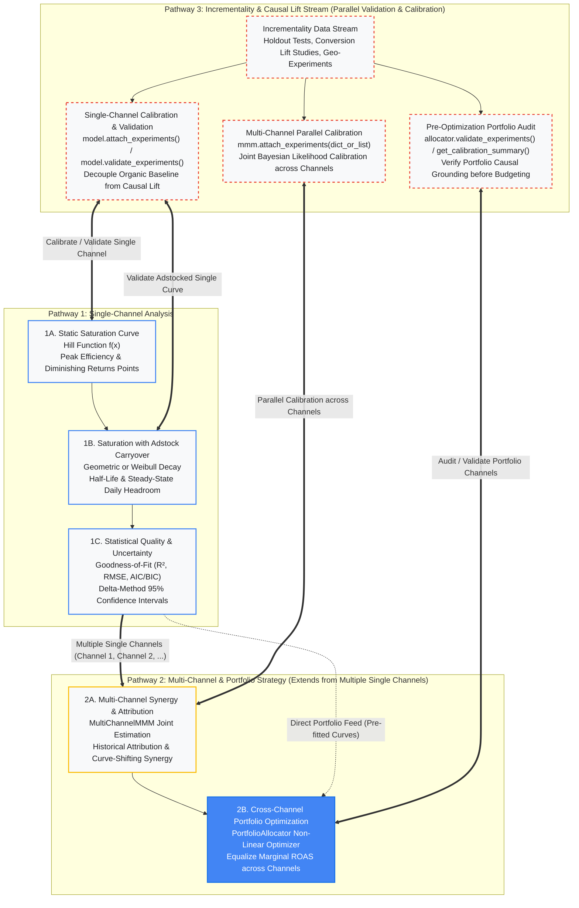

# Modular Stacking Architecture

TippingPoint is designed around three distinct, modular analytical pathways that can be stacked progressively based on business needs, channel scope, and empirical data availability:

1. **Pathway 1: Single-Channel Analysis**: Deep-dive modeling of an isolated channel (saturation curves, carryover adstock half-life, inflection points, and predictive confidence intervals).
2. **Pathway 2: Multi-Channel & Portfolio Strategy**: Extends off multiple single-channel curves to model cross-channel interactions, attribution decomposition, and global portfolio budget optimization.
3. **Pathway 3: Incrementality & Causal Calibration Stream**: A parallel validation stream where experimental data (conversion lift studies, holdout tests, geo-experiments) can be introduced at any point to validate or calibrate single-channel curves, joint MMMs, or portfolio allocations.

---



---

## Pathway 1: Single-Channel Analysis

Pathway 1 focuses on understanding the economics of an isolated marketing channel (e.g., YouTube Performance Video, Branded Search, or Connected TV).

### 1A. Static Saturation Curve
* **Core Question**: *"At what spend level does an isolated channel exit warm-up and hit diminishing returns?"*
* **Component**: [`MarketingReturnCurve`](../src/tippingpoint/models.py) fitting the Hill response function:
  $$f(x) = \frac{\beta x^\alpha}{K^\alpha + x^\alpha}$$
* **Strategic Outputs**:
  * **Peak Efficiency Point ($f''(x) = 0$)**: Inflection point where marginal return peaks. Spend below this threshold is in the inefficient warm-up zone.
  * **Stop Scaling Point ($f'(x) = \text{Target mROAS}$)**: The spend ceiling where marginal return drops below required unit economics.
  * **Optimal Scaling Zone**: The operating window between peak acquisition efficiency and diminishing returns.

### 1B. Saturation with Adstock Carryover
* **Core Question**: *"How does advertising memory and delayed conversion carryover alter daily spend headroom?"*
* **Component**: Vectorized geometric ($\theta$) or Weibull ($k, \lambda$) adstock transformations in [`src/tippingpoint/math.py`](../src/tippingpoint/math.py).
* **Strategic Outputs**:
  * **Carryover Half-Life**: $t_{1/2} = -\frac{\ln 2}{\ln \theta}$ days.
  * **Steady-State Daily Scaling Limit**: Converts effective adstocked headroom ($S_{\text{effective}}$) into daily spend limits:
    $$S_{\text{daily}} = S_{\text{effective}} \cdot (1 - \theta)$$

### 1C. Statistical Quality & Uncertainty
* **Core Question**: *"How well does the curve fit observational data, and what is the margin of error on expected returns?"*
* **Component**: Goodness-of-fit suite in [`src/tippingpoint/evaluation.py`](../src/tippingpoint/evaluation.py) and Frequentist Delta-Method in [`src/tippingpoint/models.py`](../src/tippingpoint/models.py).
* **Strategic Outputs**:
  * **Fit Diagnostics**: $R^2$, Adjusted $R^2$, RMSE, MAE, MAPE, AIC, and BIC via `model.evaluate_fit()`.
  * **Predictive Uncertainty**: 95% Confidence Intervals or 90% Credible Intervals via `model.predict_incremental_return(spend, return_interval=True)`.

---

## Pathway 2: Multi-Channel & Portfolio Strategy (Extending Off Single Channels)

Pathway 2 builds directly on top of multiple single-channel models ($M_1, M_2, \dots, M_k$) to evaluate cross-channel interactions, baseline attribution, and global budget allocation.

### 2A. Multi-Channel Synergy & Attribution
* **Core Question**: *"How do multiple media channels interact, how does upper-funnel brand consideration shift lower-funnel performance ceilings, and what drove historical returns?"*
* **Component**: [`MultiChannelMMM`](../src/tippingpoint/mmm.py) joint estimation:
  $$Y_t = \text{Baseline} + \sum_{m=1}^M \text{Hill}_m\left(\text{Adstock}_m(S_{m, t})\right) + \epsilon_t$$
* **Strategic Outputs**:
  * **Historical Contribution Decomposition**: Time-series attribution across organic baseline and individual paid media channels.
  * **Synergistic Curve-Shifting**: Visualizes how brand consideration raises the maximum incremental capacity ($\beta$) of performance channels.

### 2B. Cross-Channel Portfolio Optimization
* **Core Question**: *"Given a fixed total budget, what spend distribution maximizes total portfolio return across all channels?"*
* **Component**: [`PortfolioAllocator`](../src/tippingpoint/portfolio.py) constrained non-linear solver.
* **Strategic Outputs**:
  * **Equalizing Marginal ROAS**: Reallocates spend away from saturated channel tails into channels with high marginal headroom.
  * **Optimal Allocation Splits**: Returns exact dollar allocations for each channel subject to custom minimum/maximum business constraints.

---

## Pathway 3: Incrementality & Causal Lift Stream (Parallel Validation & Calibration)

Pathway 3 is a parallel stream where real-world causal test data (holdout studies, conversion lift tests, geo-experiments) can be brought in to **validate** or **calibrate** models at any point in Pathway 1 or Pathway 2.

```
       [ Causal Lift Data: Holdout Studies, Geo-Experiments, Conversion Lift ]
                                      │
          ┌───────────────────────────┼───────────────────────────┐
          ▼                           ▼                           ▼
  [ Single-Channel ]         [ Multi-Channel ]          [ Portfolio Allocator ]
  model.attach_experiments() mmm.attach_experiments()   allocator.validate_experiments()
  model.validate_experiments()mmm.validate_experiments()allocator.get_calibration_summary()
```

### 3A. Single-Channel Calibration & Validation
* **Standalone Scoring**: Score any fitted single-channel curve against lift tests via `model.validate_experiments()` ($Z$-scores, 95% CI coverage, reduced $\chi^2$, and qualitative verdicts: `EXCELLENT`, `ALIGNED`, `MISALIGNED`).
* **Causal Prior & Likelihood Anchoring**: Ground Bayesian single-channel fits in lift experiments (`MarketingReturnCurve.fit_bayesian(..., calibration_experiments=[...])`), preventing observational regression from over-attributing organic baseline volume ($\beta_0$) to paid media lift ($\beta$).

### 3B. Multi-Channel Parallel Calibration
* **Parallel Experiment Association**: Attach experiments across multiple channels simultaneously using channel-mapped dictionaries (`mmm.attach_experiments({"YouTube": [exp1], "Paid Search": [exp2]})`).
* **Joint Bayesian Likelihood Anchoring**: Anchors multi-channel parameter estimation simultaneously against empirical lift tests in the MCMC log-posterior.

### 3C. Pre-Optimization Portfolio Auditing
* **Pre-Budgeting Causal Health Check**: Audit calibration health across all channels in the portfolio allocator prior to running optimization scenarios via `allocator.get_calibration_summary()` and `allocator.validate_experiments()`.

---

## Flexible Adoption Scenarios

Because Pathway 3 is orthogonal and parallel to Pathway 1 and Pathway 2, practitioners can tailor their analytical progression to their data availability:

| Scenario | Workflow | Ideal Customer Context |
| :--- | :--- | :--- |
| **Observational First** | Single Channel $\to$ Multi-Channel MMM $\to$ Portfolio Allocator $\to$ Validate with Lift Tests Later | Teams with historical observational data who want immediate cross-channel budget optimization before executing formal lift tests. |
| **Causal Grounding First** | Single Channel + Lift Tests $\to$ Calibrated Single Curves $\to$ Calibrated Portfolio Allocator | Teams with rigorous testing programs (e.g., ongoing geo-experiments) who require causal validation before scaling budgets. |
| **Selective Hybrid Calibration** | Multi-Channel MMM with Lift Tests on Core Channels (e.g., YouTube, Paid Search) + Observational Priors on Exploratory Channels | Enterprise marketers with holdout studies on high-spend core channels operating alongside newer, uncalibrated media channels. |
