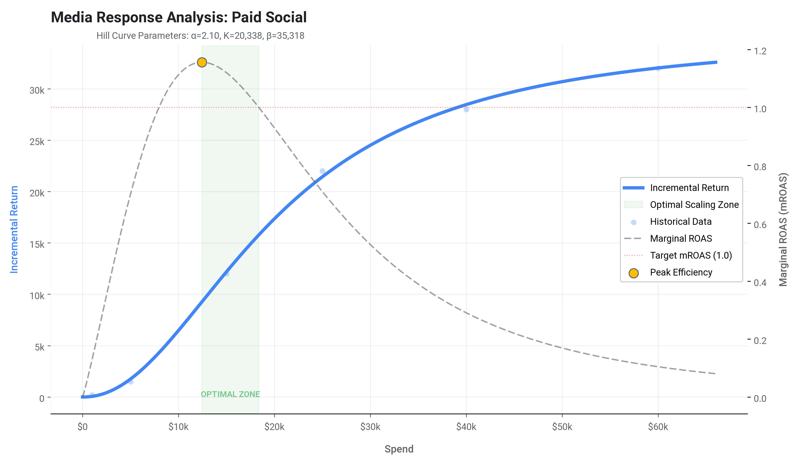
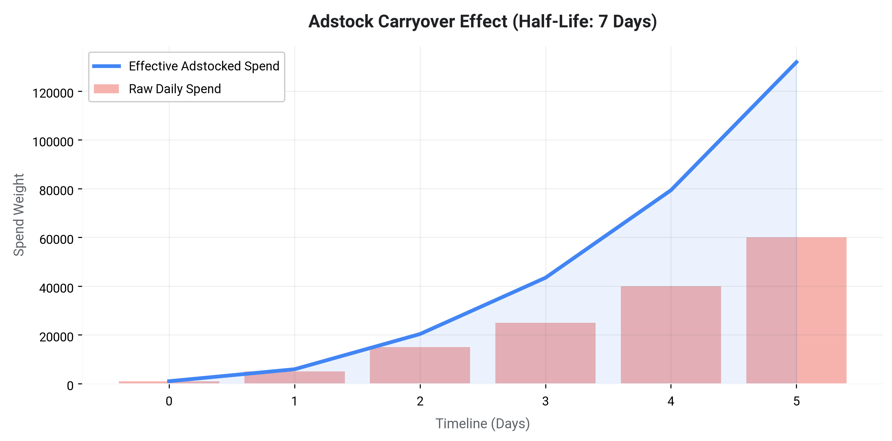
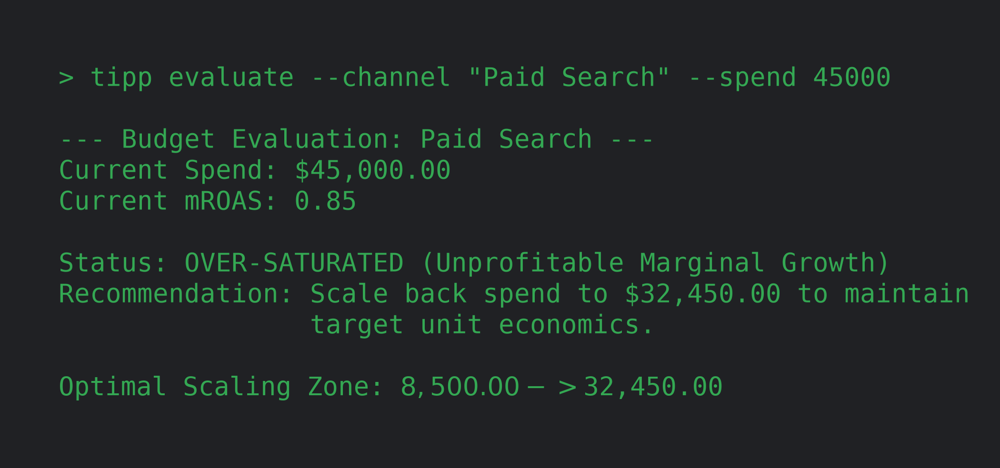

# Tipping Point: Optimizing Media Scaling through Empirical Saturation Modeling

## Abstract

**Tipping Point** is an advanced marketing intelligence module designed to help advertisers identify the optimal scaling zones for their media investments. By leveraging historical performance data, machine learning optimization (via Tinygrad), and rigorous calculus, the module determines the precise mathematical "tipping points"—specifically, the point of peak marginal efficiency and the point of diminishing marginal returns (profitability floor). This white paper outlines the underlying methodology, its conceptual alignment with Google Meridian, and the strategic implications, benefits, and limitations of relying on empirical, advertiser-specific data.

---

## 1. Methodology: The Mathematics of Media Response

The Tipping Point module relies on established econometric principles to model the relationship between media spend and incremental returns. Central to this approach are the concepts of Media Saturation and Adstock (lagged effects), drawing heavily from the open-source methodologies pioneered by Google Meridian.

### 1.1 Media Saturation (The Hill Function)

In plain terms, media saturation is the mathematical expression of "diminishing returns." It acknowledges a fundamental truth of advertising: simply spending more money or showing the same ad more times does not guarantee a proportional increase in sales. Eventually, you run out of new people to reach, or the people you are reaching stop paying attention.

From a social science and psychological perspective, this phenomenon is deeply rooted in concepts like **habituation** and **cognitive wear-out**. When consumers are repeatedly exposed to the same stimulus, their response naturally dampens over time. Similarly, economic theory dictates a law of diminishing marginal utility—the first few exposures are highly persuasive, but subsequent exposures yield progressively less impact as the most receptive audience members convert first, leaving behind a more resistant pool of non-buyers.

To model this complex psychological reality, industry-standard MMMs (including Google Meridian) employ the **Hill Function**. Originally developed in biochemistry to describe the binding of molecules, it perfectly mirrors the constraints of human attention, mapping a flexible, continuous curve between media spend and incremental return:

$$ Return = \frac{\beta \cdot Spend^\alpha}{K^\alpha + Spend^\alpha} $$

*   **$\beta$ (Beta - Capacity):** Represents the asymptote, or the absolute ceiling. No matter how much you spend, this is the maximum possible return a channel can generate before the audience is entirely exhausted.
*   **$\alpha$ (Alpha - Shape):** Dictates the learning curve. An $\alpha > 1$ creates an **S-curve**, indicating an initial "warm-up" phase where frequency builds trust before saturation sets in. An $\alpha \le 1$ creates a **C-curve**, implying that the very first dollar spent is the most efficient, with returns diminishing immediately thereafter.
*   **$K$ (Half-Saturation):** The specific spend level at which the channel achieves exactly half of its absolute maximum capacity ($\beta$).

Within the Tipping Point module, we don't just fit this curve; we analyze its rate of change. By calculating the **first derivative** (the Marginal ROAS), Tipping Point identifies two critical zones for the advertiser:
1.  **Peak Efficiency Point:** The mathematical inflection point ($f''(x) = 0$). This marks the exact moment the "warm-up" phase ends and the curve is steepest, representing the cheapest acquisition cost.
2.  **Stop Scaling Point:** The boundary where the Marginal ROAS drops below the advertiser's target profitability threshold (e.g., a return of exactly $1.00 for every $1.00 spent). Spending beyond this point is mathematically unprofitable.

### 1.2 Geometric Adstock (Lagged Effects)

In simple terms, "adstock" is the memory or the "echo effect" of advertising. If a consumer sees a television commercial on Monday but doesn't purchase the product until Friday, Monday's media spend was still responsible for generating that return. Media exposure rarely results in immediate, instantaneous conversion.

In cognitive psychology, this aligns with the principles of **cognitive persistence** and the **Ebbinghaus forgetting curve**. When a brand message is encoded into a consumer's memory, it doesn't vanish immediately when the ad stops playing; instead, it decays gradually over time. If a consumer is repeatedly exposed to the brand, this residual memory accumulates, building a stronger underlying predisposition to buy.

To account for this delayed impact, Tipping Point utilizes **Geometric Adstock**, a mathematical decay model that calculates the *effective* media spend over time, rather than just the raw daily spend:

$$ S_{t\_adstocked} = S_t + \theta \cdot S_{t-1\_adstocked} $$

Where $\theta$ is the decay rate (retention rate) between $0$ and $1$.
*   A **higher $\theta$** indicates a long carryover effect where memory persists (e.g., highly memorable brand television campaigns or out-of-home billboards).
*   A **lower $\theta$** indicates a highly transient impact that is forgotten quickly (e.g., a direct-response search ad or a fleeting social media banner).

**How they interact:** Within the Tipping Point module, these two models—Adstock and the Hill Function—do not exist in isolation; they are deeply intertwined. The model first applies the Adstock decay to understand the true, accumulated "weight" of the media in the consumer's mind. It then feeds this *adstocked spend* directly into the Hill Function. This means the module understands that you can hit "Media Saturation" (diminishing returns) not just by spending too much today, but because you spent so heavily yesterday that the consumer's memory is already completely saturated.

To provide maximum flexibility to the analyst, the module supports four adstock configurations during training:
1.  **No Adstock:** Assumes all media impact occurs in the current period with zero memory ($\theta = 0$).
2.  **Fixed Adstock:** Applies an explicitly defined decay half-life, useful if the advertiser already knows their channel's decay rate from prior studies.
3.  **Bounded Optimization:** Fits the decay parameter within a user-defined range of valid half-life days (e.g., telling the model to find the best fit, but forcing it to assume a search ad cannot be remembered for longer than 3 days).
4.  **Free Optimization:** Automatically learns the optimal $\theta$ entirely from the historical data variance, letting the machine decide how memorable the media was.

### 1.3 Portfolio Optimization (Cross-Channel Scenario Planning)

While fitting individual saturation curves provides immense value for isolating a single channel's headroom, true strategic planning requires cross-channel liquidity. Tipping Point extends its mathematical core to support full **Portfolio Optimization**, shifting the paradigm from a purely analytical view to an actionable, forward-looking planning engine.

#### The Distinction from Traditional MMMs
A full-fledged Marketing Mix Model (MMM) is primarily a *historical attribution* tool. It relies on massive multivariable regression models to untangle the "soup" of historical data—attempting to separate organic baseline sales, seasonality, pricing changes, macroeconomic factors, and cross-channel synergies. This process is notoriously complex, highly correlational, and often struggles to prove true causality without extensive calibration.

In contrast, Tipping Point's Portfolio Optimizer is an **Incrementality-Calibrated Allocator**. Instead of trying to retroactively untangle a massive, noisy baseline, it focuses exclusively on the empirically fitted saturation curves for each independent channel. When advertisers use gold-standard **incrementality studies** (like Geo-experiments or lift tests) to generate the data points that feed into this module, the paradigm shifts entirely. The module stops relying on biased, correlational platform attribution and instead fits the Hill Function to *causally proven* data. The resulting $\beta$ (capacity/headroom) and saturation ceilings are no longer probabilistic guesses; they are empirically validated truths.

#### Technical Implementation
To execute this scenario planning, the module eschews simple heuristics in favor of rigorous mathematical constrained optimization. It utilizes the **Sequential Least SQuares Programming (SLSQP)** algorithm via the `scipy.optimize` library.

The optimizer ingests an array of fitted models and systematically searches thousands of permutations to find the exact budget distribution that maximizes total incremental return for a given total budget constraint. Mathematically, the optimal portfolio allocation is achieved when the **Marginal ROAS is exactly equal across all unbounded channels**. If one channel possesses a higher marginal ROAS, the algorithm iteratively shifts a dollar from a lower-performing channel to the superior one until their rates of diminishing returns perfectly balance out.

This engine inherently supports hard business constraints (e.g., minimum or maximum spend limits per platform), allowing advertisers to instantly map how their optimal channel mix should expand, bottleneck, and shift weighting as their total investment ceiling scales up or down.

---

## 2. Empirical Grounding: The Advertiser as the Source of Truth

Unlike top-down industry benchmarks or platform-generalized forecasts, Tipping Point is an **empirical model**; it fits its saturation curves directly to the prior historical marketing data provided by the customer themselves. This approach functions similarly to a localized Marketing Mix Model (MMM).

### 2.1 Benefits of Advertiser-Specific Data

Relying purely on the advertiser's historical (spend and return/KPI) vectors provides profound systemic consistency. The resulting saturation curves inherently encapsulate and bake-in all of the customer's specific, bespoke operational realities:

*   **Funnel Dynamics:** The model naturally accounts for the advertiser's relative investment strategy across upper, mid, and lower-funnel tactics.
*   **Attribution Logic:** Whether the input data is sourced from last-click, position-based, data-driven attribution (DDA), or an existing MMM, the fitted curve represents scaling *within the reality of that chosen attribution framework*.
*   **Signal Reliability:** The model inherently adjusts to the advertiser's baseline of tracking accuracy, cookie loss, and signal fidelity.
*   **Custom Success Metrics:** Because the input vector is agnostic, the "Return" can be defined as revenue, gross profit, lead volume, or app installs. The model simply optimizes for the chosen KPI.

Because the data is their own, the output is highly consistent, trusted, and directly applicable to the advertiser's existing reporting paradigms.

---

## 3. Limitations and Strategic Caveats

While the empirical, historical grounding of the Tipping Point model is its greatest strength, it also introduces specific limitations that practitioners must navigate.

### 3.1 Sensitivity to Strategic Deviations

Because the saturation and adstock parameters ($\beta, \alpha, K, \theta$) are fitted to *historical* realities, they assume that the underlying mechanics of the marketing program remain relatively constant.

If an advertiser makes significant, structural deviations to their marketing program—such as launching entirely new creative messaging, fundamentally altering their bidding strategy, overhauling audience targeting, or experiencing a major shift in product-market fit—the historical retention curves will drift away from their current fit. In these scenarios, the model's predictions may not be reliable until sufficient new data is gathered and the model is re-trained to capture the new programmatic reality.

### 3.2 Omitted Variable Bias (Exogenous Factors)

Tipping Point is a focused bivariate/time-series model (Spend vs. Return over Time, adjusted for Adstock). It is deliberately lightweight and **does not ingest external, exogenous variables**.

Crucially, the model does not account for:
*   **Platform Dynamics:** Real-time shifts in the Google/Meta known bid environment, auction density, or competitor CPC inflation.
*   **Seasonality:** Predictable macroeconomic fluctuations, holiday spikes (e.g., Black Friday, Cyber Monday), or weather-driven demand changes.
*   **Pricing/Promotions:** Internal changes to product pricing or discount codes that alter conversion rates independently of media spend.

### 3.3 Validity Scope: Macro vs. Micro

Due to the omission of real-time exogenous variables, the output of the Tipping Point model should not be used for hyper-granular, daily bid adjustments on single, isolated campaigns.

Instead, the model's output demonstrates **increasing statistical validity when analyzing higher-level marketing initiatives over longer time horizons.** It is best utilized as a strategic compass for macro-level budget liquidity, cross-channel capital allocation, and setting broad monthly or quarterly scaling ceilings, rather than as a micro-bidding algorithm.

---

## Conclusion

The Tipping Point module democratizes access to sophisticated, Google Meridian-style media saturation and adstock modeling. By anchoring its calculus in the advertiser's own historical data, it provides highly consistent, bespoke scaling recommendations. However, strategic operators must utilize these insights with an understanding of their historical bounds, applying them primarily to macro-level budget decisions while remaining vigilant of structural programmatic shifts.