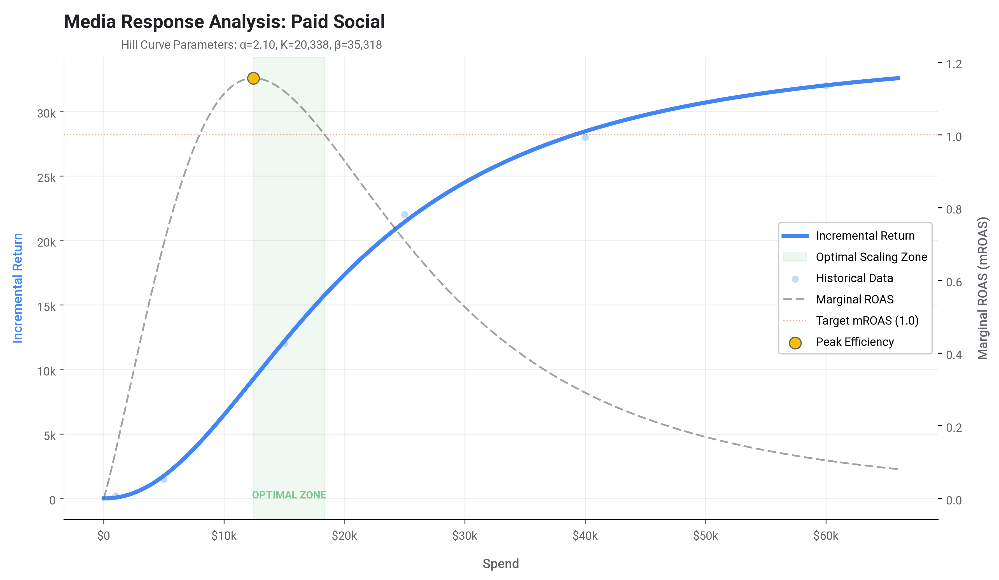
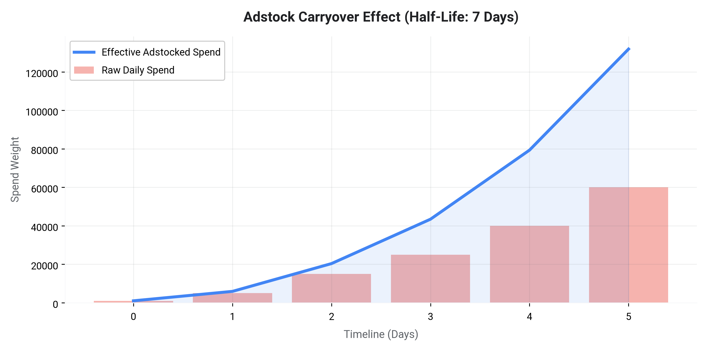

# Tipping Point: Optimizing Media Scaling through Empirical Saturation Modeling

## Abstract

**Tipping Point** is an advanced marketing intelligence and media mix modeling library designed to help advertisers identify the optimal scaling zones for their media investments. By leveraging historical performance data, GPU-accelerated gradient descent optimization (via Tinygrad), Markov Chain Monte Carlo (MCMC) Bayesian inference, and rigorous calculus, the module determines the precise mathematical "tipping points"—specifically, the point of peak marginal efficiency and the point of diminishing marginal returns (profitability floor).

The library supports both **lightweight single-channel curve fitting** and a full **Hierarchical Bayesian Media Mix Model (Meridian-lite)** that jointly estimates adstock carryover, Hill saturation, baseline organic demand, and channel scale with partial pooling and geo-level hierarchy. This white paper outlines the underlying methodology, its conceptual alignment with Google Meridian, and the strategic implications, benefits, and applications for modern growth marketing.

---

## 1. Methodology: The Mathematics of Media Response

The Tipping Point module relies on established econometric principles to model the relationship between media spend and incremental returns. Central to this approach are the concepts of Media Saturation and Adstock (lagged effects), drawing heavily from the open-source methodologies pioneered by Google Meridian.

### 1.1 Media Saturation (The Hill Function & Baseline Demand)

In plain terms, media saturation is the mathematical expression of "diminishing returns." It acknowledges a fundamental truth of advertising: simply spending more money or showing the same ad more times does not guarantee a proportional increase in sales. Eventually, you run out of new people to reach, or the people you are reaching stop paying attention.

From a social science and psychological perspective, this phenomenon is deeply rooted in concepts like **habituation** and **cognitive wear-out**. When consumers are repeatedly exposed to the same stimulus, their response naturally dampens over time. Similarly, economic theory dictates a law of diminishing marginal utility—the first few exposures are highly persuasive, but subsequent exposures yield progressively less impact as the most receptive audience members convert first, leaving behind a more resistant pool of non-buyers.

To model this complex psychological reality, industry-standard MMMs (including Google Meridian) employ the **Hill Function** augmented with an unobserved or observed **organic baseline demand** ($\beta_0$):

$$ Return = \beta_0 + \frac{\beta \cdot Spend_{adstocked}^\alpha}{K^\alpha + Spend_{adstocked}^\alpha} $$

*   **$\beta_0$ (Baseline Demand):** Organic conversions or sales that occur independently of media spend.
*   **$\beta$ (Beta - Capacity):** Represents the asymptote, or the absolute incremental ceiling. No matter how much you spend, this is the maximum possible return a channel can generate before the audience is entirely exhausted.
*   **$\alpha$ (Alpha - Shape):** Dictates the learning curve. An $\alpha > 1$ creates an **S-curve**, indicating an initial "warm-up" phase where frequency builds trust before saturation sets in. An $\alpha \le 1$ creates a **C-curve**, implying that the very first dollar spent is the most efficient, with returns diminishing immediately thereafter.
*   **$K$ (Half-Saturation):** The specific spend level at which the channel achieves exactly half of its absolute maximum incremental capacity ($\beta$).

Within the Tipping Point module, we don't just fit this curve; we analyze its rate of change. By calculating the **first derivative** (the Marginal ROAS), Tipping Point identifies two critical zones for the advertiser:
1.  **Peak Efficiency Point:** The mathematical inflection point ($f''(x) = 0$). This marks the exact moment the "warm-up" phase ends and the curve is steepest, representing the cheapest acquisition cost.
2.  **Stop Scaling Point:** The boundary where the Marginal ROAS drops below the advertiser's target profitability threshold (e.g., a return of exactly $1.00 for every $1.00 spent). Spending beyond this point is mathematically unprofitable.

### 1.2 Adstock Transformations (Geometric and Weibull)

In simple terms, "adstock" is the memory or the "echo effect" of advertising. If a consumer sees a television commercial on Monday but doesn't purchase the product until Friday, Monday's media spend was still responsible for generating that return. Media exposure rarely results in immediate, instantaneous conversion.

In cognitive psychology, this aligns with the principles of **cognitive persistence** and the **Ebbinghaus forgetting curve**. When a brand message is encoded into a consumer's memory, it doesn't vanish immediately when the ad stops playing; instead, it decays gradually over time. If a consumer is repeatedly exposed to the brand, this residual memory accumulates, building a stronger underlying predisposition to buy.

To account for delayed impact, Tipping Point provides two primary adstock modeling engines:

#### 1. Geometric Adstock
Calculates exponential decay of media weight over time:

$$ S_{t\_adstocked} = S_t + \theta \cdot S_{t-1\_adstocked} $$

Where $\theta$ is the retention rate between $0$ and $1$.
*   A **higher $\theta$** indicates a long carryover effect where memory persists (e.g., highly memorable brand video campaigns or out-of-home billboards).
*   A **lower $\theta$** indicates a highly transient impact that is forgotten quickly (e.g., a direct-response search ad or a fleeting social media banner).

#### 2. Weibull Adstock (PDF & CDF)
For channels with delayed peak response (e.g., consideration video or influencer marketing where peak engagement occurs days after launch), Tipping Point supports **Weibull PDF** and **Weibull CDF** transformations parameterized by shape $k$ and scale $\lambda$:

$$ w(l; k, \lambda) = \frac{k}{\lambda} \left( \frac{l}{\lambda} \right)^{k-1} \exp\left( - \left(\frac{l}{\lambda}\right)^k \right) $$

**How they interact:** Within the Tipping Point module, these two models—Adstock and the Hill Function—do not exist in isolation; they are deeply intertwined. The model first applies the Adstock decay to understand the true, accumulated "weight" of the media in the consumer's mind. It then feeds this *adstocked spend* directly into the Hill Function. This means the module understands that you can hit "Media Saturation" (diminishing returns) not just by spending too much today, but because you spent so heavily yesterday that the consumer's memory is already completely saturated.

---

## 2. Hierarchical Bayesian Modeling & Joint Estimation

In multi-channel settings, estimating adstock and saturation in sequential isolation leads to suboptimal, biased parameter recovery. Tipping Point implements a **Meridian-lite Hierarchical Bayesian MMM** (`MultiChannelMMM`) featuring:

### 2.1 Joint Parameter Estimation
Rather than pre-filtering adstock or fitting curves sequentially in stages, the model jointly estimates:
*   **Adstock decay rate** ($\theta_m \in (0, 1)$)
*   **Hill shape & scale** ($\alpha_m, K_m, \beta_m$)
*   **Baseline organic demand** ($\beta_0$)
*   **Observation error** ($\sigma_\epsilon$)

Sampling is conducted simultaneously on unconstrained parameter spaces ($\mathbb{R}^D$) using Gaussian random-walk Metropolis-Hastings with adaptive burn-in tuning and Gelman-Rubin $\hat{R}$ multi-chain convergence diagnostics.

### 2.2 Hierarchical Partial Pooling Across Channels
To stabilize parameters for channels with limited historical spend or noisy observations, Tipping Point introduces population hyperpriors:

$$ \beta_m \sim \text{LogNormal}(\mu_\beta, \sigma_\beta^2), \quad \alpha_m \sim \text{LogNormal}(\mu_\alpha, \sigma_\alpha^2), \quad \theta_m \sim \text{LogitNormal}(\mu_\theta, \sigma_\theta^2) $$

Partial pooling borrows statistical strength across the marketing portfolio, regularizing low-volume channels toward the population mean while allowing data-rich channels to reflect their own empirical likelihood.

### 2.3 Geo / Region-Level Hierarchy
When geo-level panel data is available (e.g. DMA or state-level observations), the model estimates geo-specific channel effectiveness multipliers:

$$ \beta_{m,g} = \beta_m \cdot \exp(\delta_{m,g}), \quad \delta_{m,g} \sim \mathcal{N}(0, \sigma_{\text{geo}}^2) $$

This captures local market idiosyncrasies while maintaining a unified national media saturation curve.

### 2.4 Incrementality Lift Calibration
To bridge the gap between correlational observational data and true causality, both the single-channel and multi-channel engines support **Bayesian prior calibration via lift experiments**. When an advertiser conducts a randomized geo-experiment or conversion lift test, the observed incremental lift ($\hat{L} \pm \text{SE}$) is incorporated as a Gaussian penalty in the posterior log-likelihood:

$$ \log \mathcal{L}_{\text{cal}} = \log \mathcal{L}_{\text{data}} - \sum_{e} \frac{(L_{\text{pred}, e} - \hat{L}_e)^2}{2 \cdot \text{SE}_e^2} $$

This anchors the saturation curve's scale and curvature to experimentally proven ground truth.

---

## 3. Portfolio Optimization & Historical Attribution

### 3.1 Cross-Channel Scenario Planning
The `PortfolioAllocator` utilizes the **Sequential Least SQuares Programming (SLSQP)** algorithm to find the exact budget distribution that maximizes total incremental return across all channels for any given portfolio budget constraint. Mathematically, optimal allocation is achieved when the **Marginal ROAS is equal across all unbounded channels**:

$$ \frac{\partial Return_1}{\partial S_1} = \frac{\partial Return_2}{\partial S_2} = \dots = \frac{\partial Return_M}{\partial S_M} = \lambda^* $$

### 3.2 Historical Contribution Decomposition
For post-campaign analysis, `MultiChannelMMM.decompose_historical_contributions()` decomposes observed time-series performance into baseline and channel-specific incremental returns, calculating historical ROI, share of spend, share of return, and current marginal efficiency.

---

## 4. Empirical Grounding: Benefits & Limitations

### 4.1 Benefits of Advertiser-Specific Data
*   **Funnel Dynamics:** Encapsulates the advertiser's specific mix of brand, consideration, and direct-response tactics.
*   **Attribution Flexibility:** Compatible with raw revenue, profit, lead volume, or app conversions.
*   **Incrementality Integration:** Directly groundable with causal lift experiments.

### 4.2 Limitations & Strategic Caveats
*   **Programmatic Shifts:** Structural deviations in creative strategy, targeting, or bidding algorithms will require refitting with fresh data.
*   **Macro vs. Micro Scope:** Designed for macro-level budget liquidity, cross-channel capital allocation, and setting quarterly scaling ceilings rather than intra-day real-time bidding.

---

## Conclusion

The Tipping Point module democratizes access to sophisticated, Google Meridian-style media saturation, adstock modeling, and hierarchical Bayesian media mix analysis. By anchoring its calculus in empirical data and causal incrementality tests, it provides robust, actionable guidance for growth marketers seeking to maximize portfolio capital efficiency.